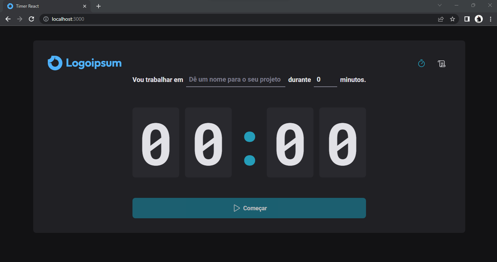
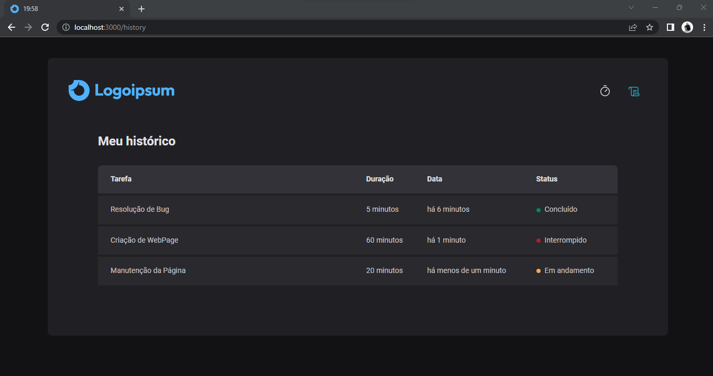

# Countdown com React e TypeScript


# Sobre o projeto

Link para Demonstração: https://timer-react-ts.vercel.app/

**Aplicação desenvolvida para portifólio.**<br>
Este projeto consiste em um aplicativo de contagem regressiva, projetado para ajudar a gerenciar seu tempo e aumentar a produtividade. Com a aplicação, você pode definir objetivos, prazos e acompanhar seu progresso de maneira simples e eficiente. Além disso, a aplicação salva em histórico todas as suas tarefas com o registro completo de quando foi iniciada, qual era o prazo e também se foi concluída, interrompida ou está em andamento, para que você possa avaliar seu desempenho e melhorar sua eficiência no futuro. Tudo isso fica salvo em localstorage, tornando a aplicação performática e simples de ser utilizada.
*Confesso que eu uso a aplicação todos os dias... Rs*

## Layout Home


# Funcionalidades 
* Adicionar o nome da tarefa atual
* Adicionar o tempo previsto para a tarefa
* Botão inativo até preencher os campos
* Navbar para a troca de páginas
* Tittle da página é alterada pelo contador quando em execução

## Layout History


# Funcionalidades 
* Processamento de todas as tarefas solicitadas
* Registro completo: tarefa, duração, data e status
* Navbar para a troca de páginas

# Componentes
* **Countdown:**
 O contador foi desenvolvido como um componente, para que a página principal não fique poluída, tornando a aplicação performática e extremamente mais simples de fazer manutenção, visando a produtividade.

* **NewCycleForm:**
  Foi desenvolvido também o componente de ciclos, que é responsável por trás da aplicação salvar todos os ciclos em variáveis e em JSONs para que possamos imprimir essas informações na página do histórico e para que fique sempre salvo na LocalStorage.


# Tecnologias utilizadas
- HTML / CSS / JS / 
- ReactJS
- TypeScript

## Bibliotecas (Dependências)

- @hookform/resolvers": "^2.9.1",
- date-fns": "^2.28.0",
- immer": "^9.0.15",
- phosphor-react": "^1.4.1",
- styled-components": "^5.3.5",
- zod": "^3.17.3"
- @rocketseat/eslint-config": "^1.1.3",
- eslint": "^8.16.0",

# Como executar o projeto

Pré-requisitos: npm / yarn

```bash
# clonar repositório
git clone https://github.com/fdfborges/timer-react-ts.git

# entrar na pasta do projeto
cd timer-react-ts

# instalar dependências
npm install

# executar o projeto
npm run dev

*Projeto configurado para rodar na porta **3000**
```

# Autor
Feito com ❤️ por Felipe Borges.
https://www.linkedin.com/in/fdfborges/
